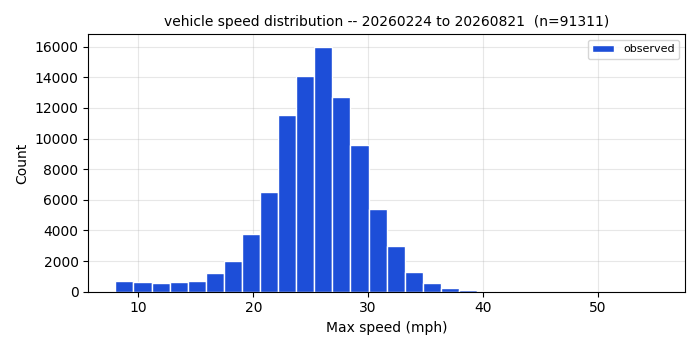
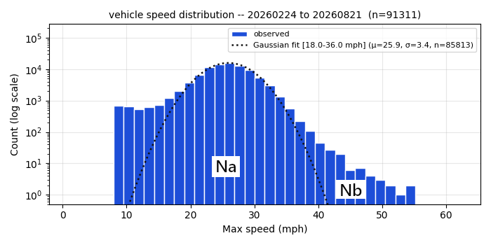

This project records data from a doppler radar traffic speed sensor and presents views of the statistics across multiple days. The location is a residential street which had been posted at 25 mph for many decades, but in Nov. 2025 was switched to 20 mph. This data is all from 2026.

A histogram of measured speed using 161 days of data (~91k traffic events) shows the speed distribution is nearly normal.

Using a log Y axis, the deviation from the normal curve is more visible, with the faster traffic extending beyond the curve. There is just under 2% of traffic that falls above and to the right of the best-fit model gaussian. This forms an excess on the high-speed side that does not match a single-population normal curve model.

The curve fit here is based on the subset of data from 18-36 mph only. Fitting the entire dataset with one gaussian widens σ and lowers the peak, which would misclassify ordinary near-peak traffic as excess. Being focused on through-traffic, this dataset excludes any returns under 8 mph, which are generally vehicles just starting or stopping, joggers, and pedestrians.

In the histogram I label the set of events under the dotted-line gaussian curve as **Na** and the points above and to the right of the curve (higher than the the fitted mean μ = 25.9 mph) as **Nb**. In this dataset **Na** (fits Gaussian) = 89683 events and **Nb** (excess above fit on high side) = 1628. The sum (89683+1628)=91311 so the quantity 1628/91311 = **1.8%** of the combined set is the fraction of traffic faster than the normal fit would predict.

This HLK-LD2415H doppler radar has a quoted accuracy of within +/- 1 km/h (0.6 mph) assuming no angular offset (the cosine-angle term). This speed data (including the fastest recorded speeds >50 mph) was cross-checked with two independent sensor systems: a set of three LIDAR-type optical gates, and conventional image-pair offset measurements at a scale of roughly 5 mm per pixel. Measured speed values agree within a few percent across all three systems.
